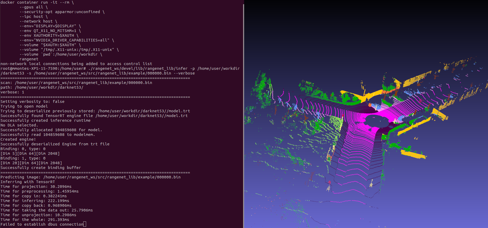

# RangeNet++ Docker

Docker container with all dependencies to be able to test the inference of RangeNet++ with C++ and TensorRT. This container have the following code inside https://github.com/PRBonn/rangenet_lib


## Dependencies

* [Docker](https://docs.docker.com/engine/install/ubuntu)

* [Nvidia-Docker](https://github.com/NVIDIA/nvidia-docker)
## Required files

* [TensorRT 5.1](https://developer.nvidia.com/nvidia-tensorrt-5x-download) must be downloaded from the official NVIDIA website. The appropriate file is: *nv-tensorrt-repo-ubuntu1804-cuda10.1-trt5.1.5.0-ga-20190427_1-1_amd64.deb*. This file must be placed in this directory, along with the Dockerfile.

* To run the demo, you need a pre-trained model, which can be downloaded here, [model](https://www.ipb.uni-bonn.de/html/projects/semantic_suma/darknet53.tar.gz). 
As the previous file, place the unzipped folder in the current directory.

## Usage

---

For simplicity of use, the **scripts/run.sh** script is used to install the necessary dependencies, create the image and run the container.

### Building

The docker image is created as follows:
```
DOCKER_BUILDKIT=1 docker build -t rangenet_cuda -f test_infer.Dockerfile .
```

### Running the container

Once we have the image created, to start the container we will use the following command:

* Minimal configuration version

```
docker run --rm -it --gpus all \
-v `pwd`:/home/user/workdir \
rangenet_cuda
```

* Full configuration version
  
```
xhost +local: && \
docker container run -it --rm \
        --gpus all \
        --security-opt apparmor:unconfined \
        --ipc host \
        --network host \
        --env="DISPLAY=$DISPLAY" \
        --env QT_X11_NO_MITSHM=1 \
        --env XAUTHORITY=$XAUTH \
        --env="NVIDIA_DRIVER_CAPABILITIES=all" \
        --volume "$XAUTH:$XAUTH" \
        --volume "/tmp/.X11-unix:/tmp/.X11-unix" \
        --volume `pwd`:/home/user/workdir \
        rangenet_cuda
```

### Working inside the container

Inside the docker container you must run the following command to test the inference:

```
./rangenet_ws/devel/lib/rangenet_lib/infer -p /home/user/workdir/darknet53 -s /home/user/rangenet_ws/src/rangenet_lib/example/000000.bin --verbose
```

The result should look like the one shown in the following image:



To test the training pipeline, it is necessary to download the [Semantic KITTI](http://semantic-kitti.org/dataset.html) dataset and labels.
Once downloaded and placed in the working directory, the following commands must be executed inside the container:

```
cd /home/user/lidar-bonnetal/train/tasks/semantic 
/visualize.py -d /home/user/workdir/semantic_kitti/data_odometry_velodyne/dataset/ -s 00
```

```
cd /home/user/lidar-bonnetal/train/tasks/semantic 
./train.py -d /home/user/workdir/semantic_kitti/data_odometry_velodyne/dataset -ac config/arch/darknet21.yaml -l /home/user/workdir/logs/
```